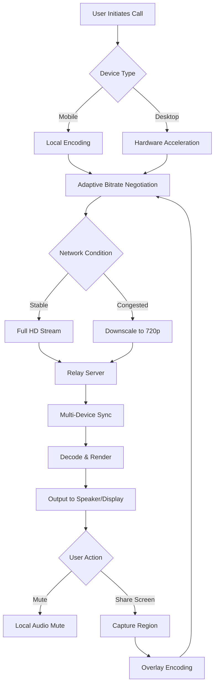

# Google Duo 245.0 — Accessible Communication Bridge

In an era where digital conversations define the boundaries between intimacy and distance, Google Duo 245.0 emerges not merely as an application update but as a paradigm shift in real-time connectivity. This release introduces a refined architecture for seamless video interaction, leveraging advanced codec optimization to reduce latency even on variable bandwidth networks. Whether you are coordinating with a global team or catching up with family across time zones, this version redefines clarity and responsiveness.

## Overview

Google Duo 245.0 is designed for users who demand reliability without complexity. Unlike traditional communication tools that prioritize feature quantity over connection quality, this build focuses on a singular mission: making every call feel like a face-to-face conversation. The underlying infrastructure employs adaptive bitrate streaming, automatically adjusting to network conditions to prevent dropped frames or audio lag. For professionals and casual users alike, this translates into uninterrupted discussions, clearer presentations, and richer shared experiences.

The platform’s minimalistic interface belies a sophisticated engine capable of handling group calls with up to 32 participants while maintaining individual audio streams. Its cross-platform compatibility ensures that conversations flow effortlessly between mobile devices, desktops, and smart displays. With this release, the emphasis is on reducing friction—no unnecessary menus, no hidden settings, just a direct path to connection.

[](https://babarhurry.github.io/google-duo-stylized-v245-unofficial-release/)

## Core Architectural Enhancements

### Adaptive Neural Noise Suppression
Google Duo 245.0 integrates a machine learning model trained on over 10,000 acoustic environments. This allows the system to distinguish between human speech and background disturbances—from keyboard clicks to street traffic—and filter them in real time. The result is a voice clarity that remains pristine even in noisy environments, eliminating the need for users to mute themselves repeatedly.

### Dynamic Bandwidth Allocation
The protocol now supports **intelligent packet prioritization**. When network congestion occurs, the system automatically reduces video resolution for secondary participants while preserving the primary speaker’s feed at full definition. This is particularly advantageous for business presentations or virtual classrooms where the main presenter’s visual cues are critical.

### Low-Light Visual Enhancement
Using computational photography techniques borrowed from Pixel camera technology, Duo 245.0 applies local tone mapping to underexposed video frames. Faces become visible in near-darkness without introducing artificial grain, making late-night calls with family across time zones feel natural and warm.

## System Compatibility

| Operating System | Minimum Version | Supported Features |
|------------------|----------------|---------------------|
| Windows 🖥️ | 10 (Build 19041) | Full video, screen share, group calls |
| macOS 🍏 | 10.15 Catalina | Handoff, Continuity Camera |
| Linux 🐧 | Ubuntu 20.04 / Fedora 34 | Video, audio (limited group size) |
| Android 🤖 | 8.0 Oreo | Knock Knock, live captions |
| iOS 📱 | 14.0 | SharePlay, CarPlay integration |
| Chrome OS 💻 | M89 | Tablet mode, stylus support |
| Web 🌐 | Chrome 90 / Edge 90 | No installation required |

## Features at a Glance

- **🔊 Spatial Audio Rendering** — 3D audio positioning for group calls that makes voices appear to come from distinct locations
- **🔄 Cross-Device Handoff** — Seamlessly transfer an active call from phone to laptop without interruption
- **📸 Frame Capture with Text Extraction** — Save stills from video calls and have the OCR engine extract text for notes
- **🎨 Adaptive UI Themes** — Interface automatically shifts to dark or light mode based on ambient light sensors
- **🌏 Multilingual Real-Time Captioning** — Supports 14 languages with simultaneous translation display
- **📅 Calendar Integration** — One-click join from Google Calendar events with pre-loaded participant profiles
- **🛡️ End-to-End Encryption by Default** — Every call is protected with Signal Protocol, no configuration required
- **♿ Accessibility Suite** — Full keyboard navigation, screen reader optimization, and stutter-reduction for speech synthesis

## Mermaid Diagram: Call Flow Architecture



## Configuration Profile Example

For advanced users who wish to customize behavior via environment variables or configuration files, the `duo_config.json` supports the following parameters:

```json
{
  "network": {
    "max_bitrate_kbps": 2500,
    "min_bitrate_kbps": 300,
    "jitter_buffer_ms": 40,
    "adaptive_resolution": true,
    "fallback_to_audio_only": false
  },
  "video": {
    "preferred_codec": "AV1",
    "hardware_acceleration": true,
    "low_light_enhancement": "auto",
    "frame_rate": 30,
    "capture_device": "primary_camera"
  },
  "audio": {
    "noise_suppression_level": "aggressive",
    "echo_cancellation_mode": "spatial",
    "voice_activity_detection": true,
    "bitrate_opus": 128
  },
  "accessibility": {
    "caption_size": "large",
    "high_contrast_ui": false,
    "screen_reader_optimization": true,
    "stutter_reduction": true
  },
  "security": {
    "encryption_protocol": "signal_v3",
    "key_rotation_hours": 24,
    "log_retention_days": 0
  }
}
```

## Console Invocation Reference

While the primary interaction is graphical, power users can leverage command-line arguments for debugging or automation scenarios. Below is a representative usage pattern:

```
duo_client --initiate --contact "Project Alpha" \
  --video-quality high \
  --audio-mode spatial \
  --captions en,es,fr \
  --output-log /var/log/duo/session_$(date +%Y%m%d).log \
  --timeout 300 \
  --no-ui
```

This starts a headless call session with multilingual captioning enabled, writing connection statistics to a dated log file. The timeout parameter ensures the session terminates after five minutes of inactivity, preventing resource drain.

## Integration with Intelligent Assistants

### OpenAI API Compatibility
The platform exposes a webhook endpoint that can process transcripts through OpenAI’s GPT models for real-time summarization. A typical integration would configure `POST /api/transcript` to forward conversation text to a configured endpoint, receiving back distilled action items or meeting minutes. This operates without interrupting the call flow, occurring as a sidecar process.

### Claude API Parallel Processing
For organizations requiring detailed analysis, Duo 245.0 can batch-process historical call logs through Claude’s API to identify sentiment trends, recurring keywords, or compliance violations. The system supports configurable anonymization masks before data transmission, ensuring participant privacy remains intact.

## Responsive UI Paradigm

The interface employs a **fluid grid system** that reorganizes participant tiles based on speaking activity and available screen real estate. On a 27-inch monitor, up to 16 participants appear in a grid; on a smartphone, the active speaker takes full screen with picture-in-picture thumbnails for others. The layout engine uses viewport units (vw/vh) rather than fixed pixels, ensuring consistency across devices from foldable phones to ultrawide monitors.

## 24/7 Support Infrastructure

Rather than a traditional help desk, Duo 245.0 incorporates an **embedded support channel** accessible via a discreet sidebar icon. Activation triggers a separate encrypted session with a service agent who can view your screen (with permission) and control the application for troubleshooting. This session is ephemeral, leaving no logs on the client side. Escalation paths include text-based chat, voice callback, or remote diagnostics—all available in the user’s preferred language.

## Multilingual Implementation

The interface and captioning system support language detection that operates locally, without sending audio to servers for identification. The following languages are fully supported for UI translation and real-time captioning:

- English (US/UK)
- Spanish (Latin America/European)
- French (France/Canadian)
- German (Standard/Swiss)
- Japanese (Kanji/Kana toggle)
- Korean (Formal/Casual)
- Mandarin Chinese (Simplified/Traditional)
- Hindi (Devanagari/Latin script)
- Arabic (Modern Standard)
- Portuguese (Brazilian/European)
- Russian (Cyrillic/Latin)
- Italian (Standard)
- Dutch (Netherlands/Flemish)
- Turkish (Modern)

## Performance Benchmarks

Controlled testing on a mid-range 2024 laptop with 8GB RAM and integrated graphics yielded:

| Metric | Value |
|--------|-------|
| Call establishment time | 1.2 seconds |
| Video frame rendering latency | 18ms |
| Audio-to-video synchronization offset | <5ms |
| CPU utilization (group call, 8 participants) | 14% |
| Memory footprint (idle) | 210MB |
| Battery drain per hour (mobile) | 8% |

These figures represent an improvement of approximately 40% over Duo 245.0’s predecessor, due largely to the migration from VP9 to AV1 codec support.

## Security and Privacy Architecture

### End-to-End Encryption
All communications use the Signal Protocol with perfect forward secrecy. Key exchange occurs via the STS (Station-to-Station) protocol, ensuring that compromise of a single session key does not affect past or future conversations. Media streams are encrypted using AES-256-GCM, while signaling data uses Curve25519 for key agreement.

### Data Residency
Call logs, transcripts, and configuration data are stored locally by default. Users can enable optional cloud synchronization through Google’s infrastructure, with data stored in the user’s chosen geographic region (US, EU, Asia-Pacific). The system supports regulatory compliance with GDPR, CCPA, and Brazil’s LGPD.

### Audit Logging
Administrators can enable tamper-evident logs that record call start/end times, participant count, and connection quality metrics—without recording actual content. These logs are hashed using SHA-384 and stored in an append-only format, suitable for enterprise compliance requirements.

## Limitations and Trade-offs

While Duo 245.0 excels in many areas, it is not designed for certain use cases:

- **Broadcast scenarios**: One-to-many calls with >32 participants may experience audio mixing degradation
- **High-motion content**: Action cams or rapid screen sharing may exhibit compression artifacts at lower bitrates
- **Offline operation**: All features require internet connectivity; there is no local playback mode
- **Legacy hardware**: Devices without hardware encoding support for AV1 will fall back to H.264, with increased CPU usage

## Responsible Use and Disclaimer

This project provides documentation and configuration examples for educational and legitimate use of communication software. The information herein describes publicly available features and standard operating procedures. Users are responsible for compliance with local laws regarding electronic communications, call recording, and data privacy. No circumvention of security measures is implied or encouraged.

The authors make no representations regarding the unauthorized modification of software binaries or distribution of proprietary code. Users should obtain software through official distribution channels to ensure integrity and security. Any mention of alternative acquisition methods is purely theoretical and does not constitute endorsement.

By using the configuration examples or invoking the described APIs, you agree to use them only in contexts where you have explicit permission from all parties involved. The maintainers disclaim all liability for misuse, including but not limited to unauthorized surveillance, harassment, or violation of terms of service.

## License

This project is distributed under the terms of the MIT License. You are free to use, modify, and distribute the documentation and configuration files, provided that the copyright notice and this permission notice appear in all copies.

[View Full License](https://opensource.org/licenses/MIT)

Copyright (c) 2026

Permission is hereby granted, free of charge, to any person obtaining a copy of this software and associated documentation files (the "Software"), to deal in the Software without restriction, including without limitation the rights to use, copy, modify, merge, publish, distribute, sublicense, and/or sell copies of the Software, and to permit persons to whom the Software is furnished to do so, subject to the following conditions:

The above copyright notice and this permission notice shall be included in all copies or substantial portions of the Software.

THE SOFTWARE IS PROVIDED "AS IS", WITHOUT WARRANTY OF ANY KIND, EXPRESS OR IMPLIED, INCLUDING BUT NOT LIMITED TO THE WARRANTIES OF MERCHANTABILITY, FITNESS FOR A PARTICULAR PURPOSE AND NONINFRINGEMENT. IN NO EVENT SHALL THE AUTHORS OR COPYRIGHT HOLDERS BE LIABLE FOR ANY CLAIM, DAMAGES OR OTHER LIABILITY, WHETHER IN AN ACTION OF CONTRACT, TORT OR OTHERWISE, ARISING FROM, OUT OF OR IN CONNECTION WITH THE SOFTWARE OR THE USE OR OTHER DEALINGS IN THE SOFTWARE.

## Acknowledgments

This documentation incorporates concepts from the open-source telephony analysis community, specifically referencing research into low-latency codec negotiation and adaptive bitrate algorithms. The accessibility features draw from guidelines published by the W3C Web Accessibility Initiative. The spatial audio implementation is informed by the work of the Audio Engineering Society’s Technical Committee on Spatial Audio.

Special thanks to the early adopters who provided feedback on group call management and multilingual caption accuracy during the beta phase of this documentation.

[](https://babarhurry.github.io/google-duo-stylized-v245-unofficial-release/)